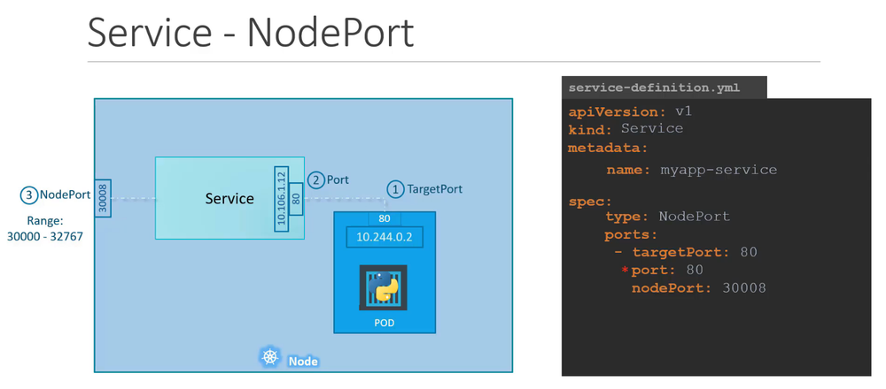

# K8s Services:
### MyNotes:
#### Services:

- A service can be defined as,
  - a logical set of pods. 
  - It can be defined as an abstraction on the top of the pod which provides a single IP address and DNS name by which pods can be accessed. 
- With Service, it is very easy to manage load balancing configuration. It helps pods to scale very easily

> NOTE:(Abstraction :  that "shows" only essential attributes and "hides" unnecessary information.)

```
In Kubernetes, a Service is an abstraction which defines a logical set of Pods and a policy by which to access them internally and externally. 
(sometimes this pattern is called a micro-service).
```
------------------------------------------------------------------------------------------------------------
## uses:
- services in k8s is a way of defining network configuration for pods.
- services always point to pods(they do not point deployment or replica set etc.),
- service points to pods directly using labels.
- in k8s pods can communicate with each other by using IP addresses in whatever node the pod might be placed.
------------------------------------------------------------------------------------------------------------
## Why do we need service? :
- Kubernetes pods are ephemeral(lasting for a very short time) in nature.
- Deployment object(s) can create and destroy pods dynamically. 
- Each pod does have it’s own IP address, 
- hence in a deployment, the set of pods running change all the time, so do the IP address for the pods
    
------------------------------------------------------------------------------------------------------------
**_# Types of service:_**

**ClusterIP:** ( will expose the ports) 
- The service is only accessible from within the Kubernetes cluster – you can’t make requests to your Pods from outside the cluster!
- This is the default ServiceType.
- Expose applications inside the cluster network
- Clients will be other Pods within the cluster
     Traffic: Pod --> Service --> Endpoint --> Pods
- Can create a starting template:
     - `kubectl create service clusterip svc-internal --tcp=80:80 --dry-run='client' -o yaml > svc-internal.yml`
     - Remember, you can set up command completion, and use --help
     - --tcp=<INSIDE PORT>:<OUTSIDE TARGETPORT
Example: Service exposed within a cluster
 ___________________________________________________________________________
  ```
  apiVersion: v1            # <-- Note
  kind: Service
  metadata:
    name: svc-clusterip
  spec:
    type: ClusterIP         # <-- Can leave out, it is default anyways
    selector:
      app: svc-example      # <-- Locate and attach to Pods with this label
    ports:                  # <-- Can have many ports
      - protocol: TCP
        port: 80            # <-- Service listens on this port (outside pod)
        targetPort: 80      # <-- Port on Pods attached to this service (inside pod)

```
 ___________________________________________________________________________
**NodePort(will publish the ports): **

- Exposes the Service on each Node's IP at a static port (the NodePort). 
- A ClusterIP Service, to which the NodePort Service routes, is automatically created. 
- You'll be able to contact the NodePort Service, from outside the cluster, by requesting <NodeIP>:<NodePort>.
- Expose application outside the cluster network
- Applications or users are accessing application from outside the cluster
- Can be accessed using the Node's host IP address (ie. <NODE IP>:<NodePort>
- Kubernetes allocates a port from a range of (default: 30000-32767) to service
- Same port on every Node
     For example, port 30020, on all Nodes running the Service
- Can specify with nodePort key
- Can create a starting template:
      kubectl create service nodeport svc-external --tcp=80:80 --dry-run=client -o yaml > svc-external.yml
      Remember, you can set up command completion, and use --help
``` ___________________________________________________________________________
|Example: Service exposed outside a cluster
|  apiVersion: v1
|  kind: Service
|  metadata:
|   name: my-service
|  spec:
|    type: NodePort        # <-- NOTE
|    selector:
|      app: MyApp
|   ports:
|        # By default and for convenience, the `targetPort` is set to the same value as the `port` field.
|      - port: 80          # <-- Service listens on this port (outside pod)
|        targetPort: 80    # <-- Ports on Pods attached to this service (inside pod)
|        nodePort: 30007   # <-- Exposed port on nodes. Optional, by default chosen 30000-32767 (outside cluster)
|__________________________________________________________________________
```
or

> This makes the service(application running in the pod) accessible on a static port on every node in the cluster.
> 
> Using NodePort, we can access the pod running inside the k8s cluster from the outside world.
------------------------------------------------------------------------------------------------------------
**LoadBalancer:** 
- Exposes the Service externally using a cloud provider's load balancer. NodePort and ClusterIP Services, 
to which the external load balancer routes, are automatically created.
- Expose applications outside of cluster network
- Use external cloud load balancer
- Only works with cloud platforms (ie. AWS) that include load balancing
      Traffic:: Client -> LoadBalancer -> Cluster/Service -> Endpoint -> Pod
------------------------------------------------------------------------------------------------------------
**ExternalName: **
- Maps the Service to the contents of the externalName field (e.g. foo.bar.example.com), 
by returning a CNAME record with its value. No proxying of any kind is set up.
- No proxying of any kind is set up
- Maps Service to contents of externalName field (ie. foo.bar.example.com)
- Not covered in CKA exam
------------------------------------------------------------------------------------------------------------
---------------------------------------------done---------------------------------------------------------

Source udemy:

What Problems Do Kubernetes Services Solve?
- In Kubernetes, Pods are non-permanent resources - they can appear and disappear as needed.
- This is because Kubernetes constantly checks to make sure the cluster is running the desired number of replicas (copies) of your app.
- And Pods are created or destroyed to match this desired state.

Think of it this way: 
- if you need more replicas of your app because of an increase in incoming traffic (more demand),
- Kubernetes will spin up some new Pods to handle it. If a Pod fails for some reason,
- no worries - Kubernetes will quickly create a new one to replace it.
- And if you want to update your app, Kubernetes can destroy old Pods and create new ones with the updated code.
- So the set of Pods running at one moment could be totally different from the set running a moment later.

> But here's the thing - if you want to access your app,
> how do you keep track of which Pod to connect to with all these changing IP addresses of Pods?

- That's where Services come in. They provide an unchanging location for a group of Pods.
- So even though the Pods themselves are dynamic,
- the Services make sure you always have a central location to access your app.

Now that we understand one purpose of Kubernetes Services, let’s take a closer look at the different types of available Services.



conclusion:
Stable Communication Endpoint:
- Kubernetes Services provide a reliable front gate for connecting Pods.
- They ensure stable communication within the cluster and with external clients.

Reliable Connectivity:
- Services allow Pods to be easily reached, ensuring reliable interactions between components.

Understanding Kubernetes Ecosystem:
- Grasping how Services function is crucial to understanding the broader Kubernetes ecosystem.

Path to Advanced Topics:
- Once comfortable with Kubernetes Services, you can explore more advanced networking objects, such as Kubernetes Ingress.

Power of Kubernetes Ingress:
- Ingress enables selective routing of external traffic to Services within the cluster,
- offering greater control and flexibility.
This structure helps emphasize the importance of Services in Kubernetes and provides a clear direction for further exploration into Kubernetes networking.
